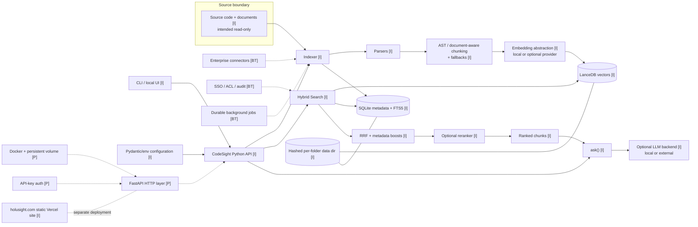
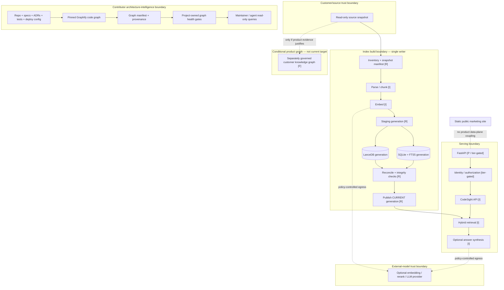
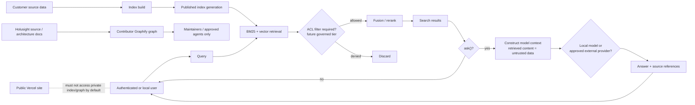
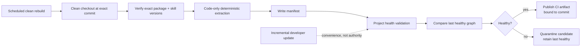

# Holusight Infrastructure and Graphify Architecture-Intelligence Research

**Research snapshot:** August 13, 2026. Holusight repository evidence was inspected at commit `5be6273fe645b3e753d7b8e18575dfa3639dcdef`; current-package and infrastructure claims were checked against canonical project, standards, and vendor documentation. This report treats the maintainer-supplied observations—especially the local Graphify result of **1,559 nodes / 0 links** and the **two-patch Graphify skill/package mismatch**—as verified local evidence, but not as externally reproducible facts.

**Authorization boundary:** this research informs a later architecture review. It does **not** authorize code changes, Graphify upgrades, dependency changes, credentials, model/provider calls, deployment, data migration, index rewriting, production configuration, or movement of private data.

## Executive decision

### Recommendation

The best current decision is **Option B: contributor-only architecture graph**, with **Option E: deterministic architecture manifest/documentation lint** as a mandatory safety companion and fallback. **Option D: layered hybrid** is the appropriate *conditional future architecture*, but only after the contributor graph proves itself and an independently justified product use case appears.

I would **not integrate Graphify into Holusight's supported product retrieval path now**.

The reasoning is unusually strong:

1. Holusight already has a coherent retrieval function: it parses and chunks source/documents, embeds them, stores vectors and keyword metadata separately, performs BM25 and vector retrieval, fuses rankings, optionally reranks, and only invokes an LLM for `ask()`. Graphify is architecturally complementary because its stated purpose is relationship traversal rather than vector retrieval. fileciteturn4file0 fileciteturn7file0 citeturn17search1
2. The local Graphify artifact is currently unusable as architecture evidence for cross-file structure: **1,559 nodes and zero links**, according to the maintainer-verified observation. A graph with no relationships cannot satisfy the requested architecture-checking role.
3. Graphify itself is still moving rapidly. The current canonical release page lists **v0.9.38, released August 9, 2026**, and several releases immediately preceding it were explicitly correctness/data-integrity fixes: v0.9.37 fixed fabricated high-confidence TypeScript call relationships and dropped Kotlin imports; v0.9.35 repaired a shrink guard that had effectively been inactive; v0.9.34 fixed path-direction and graph merge/load integrity issues; v0.9.33 fixed incremental builds dropping cross-file call edges and worker failures silently producing missing extraction results. Those fixes are evidence of healthy project maintenance, but also evidence that Graphify should not yet be treated as product-authoritative truth without project-owned validation around it. citeturn18view0
4. Holusight's repository is substantially less productionized than its business target documents imply. `pyproject.toml` identifies CodeSight as version **0.3.0** and has no FastAPI dependency; the deployment spec itself says FastAPI/Docker is **planned**; the inspected tree does not contain the proposed server or Docker deployment files. fileciteturn14file0 fileciteturn6file0 fileciteturn3file0
5. Adding a second supported product knowledge substrate now would create another consistency, security, lifecycle, versioning, and privacy problem before the first production boundary is mature.

**Confidence: high, approximately 0.87.** The recommendation would change primarily on local evidence: whether a clean, version-pinned Graphify run can recover highly accurate deterministic relationships; whether graph-derived checks find defects that tests and document lint do not; and whether actual customers need relationship-aware retrieval rather than ordinary hybrid retrieval.

### Where the status quo wins

Option A, or more realistically the lightweight Option E described below, should win if any of these occur:

| Evidence from local validation | Decision consequence |
|---|---|
| Clean Graphify builds still miss ordinary cross-file imports/calls or produce material false relationships | Do not make Graphify a required architecture source |
| Graphify deterministic relationships are unstable between equivalent clean builds | Keep it advisory only |
| Graph-derived architecture rules do not catch meaningful issues beyond static tests and documentation lint | Prefer E over B |
| Maintaining Graphify version compatibility/rules consumes more engineering effort than the architecture risk it removes | Prefer E |
| Repository remains small, single-maintainer, local-only, and its architecture remains understandable from code plus executable tests | Status quo remains rational |
| Privacy controls cannot prove that CI code-only operation makes no unapproved network/model calls | Do not run Graphify on restricted repositories |
| Product users have no demonstrated relationship-query use case | Never progress from B to D/C |

The strongest case against Graphify integration is therefore not “graphs are bad.” It is that **derived static-analysis truth is another system that can drift**. Graphify's own latest release history documents recent cases involving fabricated edges, silently dropped edges, corrupted incremental state, and ineffective shrink protection. Deep integration would amplify those failure modes into product behavior before Holusight has demonstrated a need for them. citeturn18view0

### Ranked option decision

I used the user's criterion ordering as a weighting order rather than pretending the score is empirical. The weights are: correctness/provenance 16, privacy/security 14, completeness 12, simplicity/debuggability 10, robustness 9, maintainability 8, freshness 7, reversibility 6, scalability 5, provider portability 4, cost 3, delivery speed 2.

| Option | Weighted result | Assessment |
|---|---:|---|
| **B — contributor-only graph** | **88.8 / 100** | **Recommended now.** Best balance of architectural coverage, privacy, reversibility, and useful drift detection |
| **E — architecture manifest + provenance/document lint** | **87.3 / 100** | Mandatory companion and fallback; simpler but weaker relationship coverage |
| D — layered contributor graph + separately governed product KG | 76.1 / 100 | Good *future* pattern if user-facing graph value is independently established |
| A — occasional Graphify + prose | 64.8 / 100 | Acceptable while product remains small; weak drift/freshness guarantees |
| C — product-integrated Graphify | 50.4 / 100 | Not justified now; creates provenance, privacy, duplication, and operational risks |

The important distinction is that **B does not imply Graphify is “the architecture.”** It makes Graphify one evidence-producing architecture analyzer whose output is accepted only if a project-owned health gate passes. This follows the broader provenance principle that information should retain its derivation and producing activity rather than be flattened into an unexplained assertion; W3C PROV provides stable concepts such as entities, activities, agents, derivation, attribution, and bundles that fit this requirement. citeturn22view0

## Architecture baseline and target boundary

### What is actually implemented, documented, or unresolved

The repository already demonstrates why provenance must become a first-class architectural property.

| Area | Evidence at inspected commit | Classification | Important conflict |
|---|---|---|---|
| CodeSight Python API | `CodeSight` provides `index`, `search`, `ask`, `status` and lazy store/embedder/LLM initialization | **Implemented** | None material in inspected source fileciteturn7file0 |
| Local ingestion | Walks filesystem, honors skip lists and `.gitignore`, handles code/text/PDF/DOCX/PPTX | **Implemented** | Enterprise connectors are separate future documents fileciteturn8file0 |
| Tree-sitter chunking | Architecture/source describe AST path plus fallbacks | **Implemented in code path** | `specs/README.md` still labels Tree-sitter spec “Planned / Future”; stale provenance must be fixed, not silently reconciled fileciteturn4file0 fileciteturn5file0 |
| Incremental behavior | Existing chunk hashes are compared and unchanged chunks skipped; timestamp-based auto-refresh exists | **Partially implemented** | Spec index labels “Incremental Refresh” planned; terminology and completeness are inconsistent fileciteturn8file0 fileciteturn7file0 fileciteturn5file0 |
| Vector storage | Local LanceDB | **Implemented** | No product-level transaction with SQLite fileciteturn9file0 |
| Keyword/metadata storage | SQLite + external-content FTS5, triggers, WAL | **Implemented** | Cross-store consistency not transactional fileciteturn9file0 |
| Hybrid retrieval | BM25 + vector + RRF, optional metadata/reranking paths | **Implemented** | Benchmark claims in architecture documentation should remain benchmark evidence, not architectural fact fileciteturn4file0 |
| LLM synthesis | Retrieved snippets are inserted into an LLM prompt when `ask()` is invoked | **Implemented, optional** | Explicit prompt-injection/content-trust controls are not visible in inspected API path fileciteturn7file0 |
| Read-only source invariant | Explicit security regression test checks no new source files are created | **Tested invariant** | Container-level enforcement is future work fileciteturn13file0 |
| FastAPI | Detailed proposed interface/spec | **Planned** | No corresponding FastAPI dependency in current project manifest fileciteturn6file0 fileciteturn14file0 |
| Docker production image | Described in planned spec | **Planned** | Not established by inspected repository tree fileciteturn3file0 fileciteturn6file0 |
| API-key auth | Proposed middleware | **Planned** | Not current security control fileciteturn6file0 |
| SSO / ACL enforcement | Business specifications | **Business target / future architecture** | Must never be rendered as current implementation fileciteturn16file0 |
| Enterprise connectors, Qdrant/Azure Search/Postgres/jobs | Business infrastructure document | **Business target / design proposal** | Far beyond CodeSight 0.3.0 current implementation fileciteturn15file0 fileciteturn14file0 |
| Vercel site | Regression test explicitly requires static landing deployment rather than Python/FastAPI | **Implemented public-site architecture** | Must remain separate from product deployment claims fileciteturn12file0 |
| Graphify | Rules/workflows/artifacts exist; local run reportedly 1,559 nodes/0 links | **Tooling exists; graph health failed locally** | Local skill/package patch mismatch; relationship output cannot presently establish architecture |

There is another possible code/spec discrepancy worth testing rather than declaring a defect: `force_rebuild=True` is documented as deleting the existing index, while the inspected `index_repo()` section logs the force-rebuild condition but does not show a clearing operation before it processes files. Likewise, the visible algorithm iterates files currently on disk; external review alone cannot establish whether deleted-source chunks are fully reconciled elsewhere. Those are **local test questions**, not findings of corruption. fileciteturn8file0

### Current-state reference architecture

Legend: **[I]** inspected implementation or verified local fact; **[P]** documented plan; **[BT]** business target only.



This map is the smallest coherent reference architecture supported by inspected source and repository documents. The stable organizing principle is the `CodeSight` Python API with separate indexing and searching paths; the persistent search representation is currently local LanceDB plus SQLite FTS5, not a network database. fileciteturn4file0 fileciteturn7file0 fileciteturn8file0 fileciteturn9file0

### The provenance model that should replace ambiguous “current architecture”

A single graph **can** contain code, specifications, decisions, deployment, operations, requirements, telemetry, security boundaries, and evidence, but only if “what the thing is” is separated from “how we know it” and “where/when it is true.” W3C PROV explicitly supports provenance bundles and qualified derivation relationships, making it a useful conceptual base without requiring Holusight to adopt RDF or PROV-O literally. citeturn22view0

Every architectural claim should have these independent axes:

| Field | Required meaning |
|---|---|
| `architecture_status` | `IMPLEMENTED`, `PLANNED`, `PROPOSED`, `DEPRECATED`, `REJECTED`, `UNKNOWN` |
| `environment` | `SOURCE`, `LOCAL`, `CI`, `STAGING`, `PRODUCTION`, `TARGET` |
| `evidence_class` | `EXECUTABLE_CODE`, `TEST`, `STATIC_CONFIG`, `BUILD_ARTIFACT`, `DEPLOYMENT_OBSERVATION`, `TELEMETRY`, `ADR`, `SPEC`, `BUSINESS_TARGET`, `RESEARCH`, `HUMAN_ASSERTION` |
| `origin` | `EXTRACTED`, `STATIC_RESOLUTION`, `INFERRED`, `DECLARED`, `OBSERVED` |
| `repo_commit` | Exact repository commit or `null` only when inherently non-repository evidence |
| `extractor` / `extractor_version` | Tool and exact version responsible for derived information |
| `source_location` | File/URI plus line/range/symbol where available |
| `content_hash` | Hash of the supporting entity or input bundle |
| `observed_at` | When evidence was produced or observed |
| `fresh_until` | Policy/SLO date or calculated staleness boundary |
| `owner` | Responsible maintainer/team, not inferred from git history unless marked inferred |
| `privacy_class` | At least `PUBLIC`, `INTERNAL`, `CONFIDENTIAL`, `RESTRICTED` |
| `confidence` | Confidence in the relationship resolution—not a substitute for status or environment |

Three invariant rules matter most:

**A specification cannot prove implementation.** An `IMPLEMENTED` claim requires executable/configuration evidence at a bound commit. A passing test can strengthen that claim, but a business roadmap cannot.

**Source cannot prove deployment.** A `PRODUCTION` claim requires deployment/runtime evidence such as an image digest, deployment manifest, signed release record, or telemetry from the running artifact.

**Confidence cannot change provenance.** A 0.99-confidence inferred edge remains inferred. It cannot become “observed” or “implemented” by score.

This avoids the precise failure already visible in the repository: Tree-sitter behavior appears in code while the spec index still says “planned,” and production infrastructure is elaborately documented while remaining absent from the current product package. fileciteturn5file0 fileciteturn8file0 fileciteturn6file0

### Proposed target architecture

The target should remain **single-node and embedded by default**, but change the indexing lifecycle so that LanceDB and SQLite are published as a *single logical generation*. Graphify sits outside that product data plane.



The key reliability change is **not** “replace LanceDB/SQLite.” It is to stop treating two independently committed stores as if they already formed one transaction.

The inspected `ChunkStore.upsert_chunks()` mutates LanceDB and then commits metadata into SQLite. There is no atomic transaction spanning those engines. A crash between those operations can therefore leave the two representations disagreeing even though each store individually behaved correctly. fileciteturn11file0

A safe target is:

```text
~/.codesight/data/<repo-id>/
    generations/
        <generation-id>/
            lance/
            metadata.db
            manifest.json
            integrity.json
    CURRENT
```

A writer constructs a candidate generation, closes/checkpoints it, verifies that Lance and SQLite contain the expected chunk-ID set, verifies FTS integrity, validates model/schema metadata, and only then publishes `CURRENT` using a target-filesystem mechanism whose atomic replacement semantics have been tested locally. Readers bind to one generation and do not observe half of an update.

This is more robust than trying to invent a distributed transaction between two embedded databases. LanceDB already has table versioning and rollback mechanisms, but those versions cover Lance tables; they cannot make LanceDB and SQLite atomic as a combined product store. citeturn19search7

SQLite itself supplies an FTS5 `integrity-check` mechanism that can verify FTS internal consistency and, for an external-content FTS table, compare the index with its content table. That should be an acceptance check before a generation becomes current. citeturn19search8

### Data flow and trust boundaries



The LLM boundary needs explicit treatment because `ask()` currently formats retrieved snippets directly into the model context. No explicit content-trust or prompt-injection control is apparent in the inspected API path. OWASP's LLM01:2025 guidance treats prompt injection—including indirect injection originating in external content—as a core LLM application risk; retrieval itself does not convert source documents into trusted instructions. fileciteturn7file0 citeturn21view3

Accordingly, customer documents and Graphify-derived prose must always be **data**, never authority to alter tools, permissions, retrieval ACLs, system configuration, or security policy.

## Component gaps, reliability, and security

### Component-by-component gap assessment

| Component | Current evidence | Production gap | Minimum credible target |
|---|---|---|---|
| Ingestion | Local file walking with extension, size, ignore and skip logic fileciteturn8file0 | No durable source snapshot; deletion/rename reconciliation needs explicit verification; connectors only aspirational | Input manifest containing source path/ID, hash/mtime where suitable, commit when available, inventory count, scan completion state |
| Parsing | PDF/DOCX/PPTX plus text/code paths fileciteturn8file0 | Parser failures are logged/skipped; no production error quarantine contract established | Per-file outcome manifest; parse failure count; fixture corpus; “partial build” cannot silently publish |
| Chunking | AST/document-aware plus fallbacks documented/implemented fileciteturn4file0 | Spec status stale; grammar/version provenance weak | Record chunker + grammar versions and fallback used per chunk; regression fixtures |
| Embeddings | Local/provider abstraction; model mismatch can trigger rebuild fileciteturn7file0 | Model alone is insufficient schema identity; provider egress not centrally governed | Bind backend, model, dimension, normalization/config, provider and privacy policy to generation manifest |
| LanceDB | Embedded vector storage fileciteturn9file0 | Cross-process read freshness must be deliberate; not atomic with SQLite | Immutable/published generation; explicit read consistency where live writer sharing exists |
| SQLite/FTS5 | WAL, chunks table, external-content FTS5/triggers fileciteturn9file0 | One-writer semantics; WAL lifecycle; no cross-store transaction | Single index writer; FTS integrity check; runtime SQLite version check; no multi-host WAL sharing |
| Cross-store consistency | Shared chunk IDs | Lance write occurs independently of later SQLite commit fileciteturn11file0 | Candidate generation + full reconciliation + one publication point |
| Retrieval | BM25/vector/RRF and boosts | Need stable eval corpus and latency/correctness SLOs | Regression benchmark per corpus version; record retrieval configuration with index |
| Reranking | Optional | External-provider privacy/cost/failure path; model quality can regress | Explicit opt-in backend; egress classification; quality and fallback benchmark |
| LLM | Optional `ask()` pipeline | Retrieved documents enter prompt; no visible prompt-injection trust boundary | Treat content as untrusted; strict provider policy; answer/source auditing appropriate to tier |
| Python API | Single CodeSight entry point | No network-service controls needed locally | Keep stable; network adapter remains thin |
| UI | Local/demo interfaces plus separate public static site | Do not make public landing site into product backend accidentally | Explicit deployment topology and separate domains/configuration |
| FastAPI | Planned spec fileciteturn6file0 | Concurrency claims unmeasured; proposed four workers may conflict with embedded writable-store assumptions | Add only when remote/multi-user need exists; begin with one application process and one writer, then benchmark |
| Docker | Planned | Source mount, persistence, health, image provenance still future | Read-only source mount; persistent generation volume; non-root/minimal runtime where feasible; health/readiness |
| Jobs | Business target only fileciteturn15file0 | No durable queue/idempotency/backpressure | Synchronous or one in-process writer first; add durable queue only on measured need |
| Authentication | API-key proposal | Shared key cannot provide user-level authorization semantics | API key only for narrow trusted pilot/service access; external identity when user authorization matters |
| ACL | Business target spec fileciteturn16file0 | No current ACL filtering; freshness/revocation contract unimplemented | Fail-closed authorization before retrieval in both vector and keyword paths |
| Audit | Business target only | Retention, privacy, immutability not defined | Record identity, policy version, permitted sources and action without unnecessarily retaining sensitive query text |
| Secrets | Env-based provider configuration | Need lifecycle, masking, least privilege, startup validation | External secret injection mechanism appropriate to hosting platform; no secret nodes/values in graph |
| Observability | Basic Python logging is present; production telemetry not established | No service SLO signals or correlation | Structured logs plus OTel-compatible traces/metrics when networked |
| DR/backups | Embedded files | No documented generation backup/restore drill | Generation checksums, retention, tested restore and rollback |
| Testing | Search/chunk/security/static-site tests visible; security suite covers FTS input, chunk IDs, source-read-only behavior and path validation fileciteturn13file0 | No verified crash-consistency, concurrent-index, ACL, server, job, Graphify-health or deployment-drift suite | Add those tests before corresponding features can claim production status |
| Developer architecture workflow | Graphify rules/workflows/artifacts exist | Local graph is zero-edge; package/skill mismatch; no trustworthy gate | Exact-version contributor graph + project-owned validator + last-known-good artifact |

### Embedded storage is still a reasonable choice—but with constraints

SQLite WAL is not inherently a reason to migrate. It allows readers and a writer to proceed concurrently, but **there can only be one writer at a time**, and WAL is a same-host mechanism rather than a network-filesystem/multi-host database architecture. The WAL file is also part of the database's persistent state and must not be separated casually from its database file. citeturn21view0

That makes the simple near-term architecture clear:

**many readers can be acceptable; one controlled index writer should be the invariant.**

There is also a time-sensitive issue worth adding to the local preflight. SQLite's official WAL page now documents a rare “WAL-reset bug” affecting SQLite 3.7.0 through 3.51.2 under specific concurrent write/checkpoint conditions; SQLite states that it is fixed in **3.51.3, released March 13, 2026**, with selected backports, and recommends affected applications upgrade. The actual SQLite library loaded by Holusight's Python runtime is not established by the repository files examined here, so `sqlite3.sqlite_version` must be recorded by any later deployment benchmark before multi-connection WAL write testing. citeturn21view0

LanceDB also has an important multi-process subtlety: in the current OSS documentation, if `read_consistency_interval` is unset, a table does **not automatically refresh** from writes made by another process; zero causes a refresh check on every read and a nonzero interval provides eventual refresh. Immutable published generations largely eliminate the need to coordinate live mutable readers and writers at all. citeturn19search0

These facts specifically weaken the current deployment spec's unsupported assumption that “four workers” is automatically the correct production setting. FastAPI's own documentation says the process arrangement is use-case dependent; in clustered deployment it commonly recommends one process per container, while multiple workers can be reasonable on one simple server. It explicitly frames these as choices to validate against memory, replication, startup, and workload characteristics rather than rules. citeturn20search2

### Failure-mode and threat-model matrix

| Failure / threat | Current exposure | Proposed mitigation | Gate before production claim |
|---|---|---|---|
| Lance succeeds, SQLite fails | Possible because writes are separate | Build private generation, reconcile chunk IDs, publish only after all checks | Crash injection after every persistence boundary |
| SQLite succeeds but vector state missing/wrong | Same class | Bidirectional ID/count/checksum reconciliation | Deliberately corrupt/remove vector rows and ensure candidate rejection |
| Crash during index rebuild | No publication transaction demonstrated | Last-known-good generation remains current | Kill process at randomized stages; current index must remain queryable |
| Concurrent index writers | Planned lock only | One writer lock/lease; idempotent generation/job ID | Parallel-index test must yield one winner, no corruption |
| Deleted source retains stale chunks | Needs local verification | Full source inventory and orphan reconciliation; periodic clean rebuild | Delete/rename test with zero stale retrievals |
| Embedding model/dimension drift | Model string partly tracked | Full embedding schema fingerprint | Hard refusal on mismatch |
| SQLite WAL multi-process hazard | Current WAL mode; runtime SQLite version unknown | Verify patched runtime; single writer; controlled checkpoints | Record runtime SQLite version and concurrency test citeturn21view0 |
| Stale Lance table view across workers | Relevant if mutable tables shared cross-process | Immutable generation or explicit read consistency | Writer/read freshness test citeturn19search0 |
| FTS trigger/index inconsistency | External-content FTS | `integrity-check` before publication; rebuild on failure | Inject mismatch, require failure/quarantine citeturn19search8 |
| Graphify zero-edge graph | Verified local occurrence | Fail graph-health gate; preserve last healthy artifact | Multi-module fixture with mandatory known relationships |
| Graph unexpectedly shrinks | Graphify has guards, but recent release fixed a previously ineffective guard | Independent baseline comparison + quarantine; never auto-overwrite healthy artifact | Simulated partial extraction and >threshold shrink test citeturn18view0 |
| Graphify fabricated relation | Recent TS correctness fix demonstrates class of risk | Preserve EXTRACTED/INFERRED/AMBIGUOUS/raw origin; deterministic-only enforcement rules | Curated precision test citeturn18view0 |
| Incremental graph differs from clean rebuild | Recent Graphify release fixed dropped cross-file edges | Scheduled clean rebuild; compare deterministic relation sets | Incremental-vs-clean equivalence fixture citeturn18view0 |
| Planned design appears “running” | Present documentation provenance problem | Status/environment/evidence axes; no promotion from prose alone | CI provenance lint |
| Prompt injection from indexed document | `ask()` concatenates retrieved snippets into LLM context | Untrusted-content policy; no tool/security authority from retrieved text | Adversarial-document test fileciteturn7file0 citeturn21view3 |
| Provider data exfiltration | Optional external embeddings/rerank/LLM; Graphify docs semantics may use model | Explicit egress policy, backend pinning, code-only Graphify CI | Network-deny test in restricted mode |
| ACL staleness exposes revoked data | Future enterprise design risk | Fail closed; version ACL snapshot; defined maximum staleness; revocation test | Permission-revocation SLO |
| Cross-tenant leakage | Multi-tenancy not current | Prefer deployment/index isolation until strong reason to share | Canary and property-based authorization tests |
| Query/audit logs leak sensitive questions | Relevant to both product and Graphify | Data minimization, redaction, access/retention policy; explicitly configure Graphify logging | Log inspection / no-secret test |
| Supply-chain compromise | Lockfile exists, but deployment provenance not established | Consume lockfile, SBOM/provenance for releases, signature verification in higher tiers | Reproducible build/dependency-policy gate |
| Backup is incomplete because SQLite WAL omitted | Relevant if live DB copied naively | Publish closed/checkpointed immutable generations; back up generation as a unit | Restore drill citeturn21view0 |
| Graph artifact reveals internal architecture | Contributor graph contains paths/components/security relationships | Classify at least as sensitive as input; never public by default | Artifact-access review |
| Marketing site becomes accidental product plane | Static Vercel architecture explicitly distinct | Keep network/deployment configs separate | Static-site regression remains enforced fileciteturn12file0 |

Docker can enforce the existing read-only-source intention at a stronger OS/container boundary using a bind mount with `readonly`/`:ro`; Docker's documentation notes that ordinary runtime bind mounts are otherwise read-write by default. citeturn19search2turn19search14

For service health, “status” should not be overloaded into one concept. A proposed network service should expose at least **liveness** (“process/event loop functioning”) and **readiness** (“a validated CURRENT generation is open and required local dependencies are usable”). Docker supports explicit `HEALTHCHECK` status, but application-level readiness should remain distinct from an expensive end-to-end LLM/provider call. citeturn20search0

For observability, OpenTelemetry is a suitable portability boundary because its current signal model standardizes traces, metrics, and logs without tying Holusight's architecture to a specific monitoring vendor. It should be added to a networked deployment when SLO diagnosis is needed, rather than turning the pilot into an observability platform project. citeturn21view1

## Graphify model, lifecycle, and integration boundary

### Graphify's proper responsibility

Graphify's official description supports the conceptual split the working assumption proposed: code is locally parsed with Tree-sitter, its graph exposes relationships with `EXTRACTED` and `INFERRED` provenance, and Graphify explicitly describes itself as **not a vector index**. That makes it naturally complementary to Holusight's lexical/vector retrieval rather than a replacement for it. citeturn17search1

The boundary should be:

```text
Holusight product plane
    authoritative input:
        customer / project source documents
    purpose:
        retrieve relevant content and optionally answer from it
    authoritative product artifact:
        validated search-index generation

Graphify contributor plane
    authoritative input:
        Holusight repository + architecture evidence
    purpose:
        map dependencies, trace architecture, detect drift,
        support maintainer/agent reasoning
    derived artifact:
        validated architecture graph bundle

Conditional future product-KG plane
    authoritative input:
        customer-authorized source snapshot
    purpose:
        relationship-aware product features proved valuable by research
    artifact:
        separately governed knowledge graph
    rule:
        never silently reuse the contributor architecture graph
```

That prevents the recursive failure mode in which Holusight indexes `graphify-out`, Graphify maps Holusight's generated artifacts, and derived summaries begin to outrank original evidence. **Generated graph artifacts should be excluded from ordinary product ingestion by default.**

Combining the tools is valuable at query orchestration boundaries: an agent could use Graphify to identify the relevant subsystem and then ask Holusight for source/document context, or use Holusight to find a specification and Graphify to trace code relationships around the implementation. They should exchange **stable IDs and evidence references**, not copy each other's entire data stores.

### Proposed architecture graph schema

A useful graph should model not merely source symbols, but architectural claims and their evidence.

#### Node vocabulary

| Node type | Examples | Source of truth |
|---|---|---|
| `Repository` | Holusight | SCM metadata |
| `Commit` | exact SHA | Git |
| `File` | `src/codesight/store.py` | source tree |
| `Module` | `codesight.store` | deterministic language/package resolution |
| `Symbol` | class/function/method | AST |
| `DataModel` | Pydantic class, Arrow schema | code/schema |
| `StorageObject` | Lance table, SQLite table/FTS index | code/schema/migration |
| `APIContract` | `CodeSight.search`, future HTTP route | executable signature/router/OpenAPI |
| `ConfigKey` | `CODESIGHT_*` | config code/schema |
| `ExternalProvider` | embedding/rerank/LLM provider | config + call site |
| `DeploymentUnit` | container, process, job | real deployment/build evidence |
| `RuntimeDependency` | Python package, executable, service | lock/build/runtime observation |
| `TrustBoundary` | source, index, provider egress, public site | declared architecture/security policy |
| `Requirement` | access-control or reliability requirement | spec |
| `Specification` | feature/business spec | document |
| `ADR` | architecture decision | ADR |
| `Test` | test function/suite | source/test collection |
| `TelemetrySignal` | span/metric/log schema | instrumentation/runtime |
| `Owner` | maintainer/team | explicit ownership mapping |
| `Evidence` | test result, build manifest, telemetry sample | underlying evidence system |
| `GraphBundle` | generated graph at commit/version | Graphify/validator manifest |

#### Edge vocabulary and evidence class

| Relation | Default treatment | Reason |
|---|---|---|
| `CONTAINS`, `DEFINES` | **Deterministic** | Direct AST/filesystem structure |
| `IMPORTS` | Deterministic when source import and target resolution are unambiguous | Syntax plus resolver evidence |
| `CALLS` | Deterministic only when callee resolution is unique; otherwise inferred/ambiguous | Dynamic languages make name resolution contextual |
| `INHERITS`, `IMPLEMENTS_PROTOCOL` | Deterministic when target resolves uniquely | Static relationship |
| `READS_FROM`, `WRITES_TO` | Deterministic at explicit SQL/API/store call sites; otherwise inferred | Data-flow resolution can cross abstraction layers |
| `DECLARES_CONFIG` | Deterministic | Static config definitions |
| `ROUTES_TO` | Deterministic when router/decorator registration is visible | API evidence |
| `DEPENDS_ON` | Deterministic from manifest/lock; runtime variant can be observed separately | Prevents imported-but-undeclared ambiguity |
| `TESTS` | Deterministic for explicit test target; inferred for broad behavioral coverage | Avoid pretending import == behavior coverage |
| `BUILT_FROM` | Observed/build evidence | Needs build manifest, not source inference |
| `DEPLOYED_AS` | **Observed only** | Source cannot establish deployed reality |
| `OBSERVED_IN` | Observed | Telemetry/deployment inventory |
| `OWNED_BY` | Deterministic only with explicit ownership config | Git-history ownership should remain inferred |
| `SATISFIES` | Usually inferred/reviewed | Requirement-to-code traceability is semantic |
| `CROSSES_TRUST_BOUNDARY` | Inferred or declared unless runtime/network policy proves it | Architectural interpretation |
| `SUPPORTED_BY` | Deterministic pointer to evidence | Provenance |
| `CONTRADICTED_BY` | Deterministic when conflicting claims are explicit; otherwise reviewed | Preserve conflict instead of erasing it |
| `SUPERSEDES` | Deterministic when ADR/spec metadata says so | Lifecycle provenance |
| `DERIVED_FROM` | Deterministic provenance relationship | Mirrors standard provenance concepts |
| `DRIFTED_FROM` | Computed | Comparison relation, with rule/version |

A software graph containing multiple relationship families is a well-established architecture-analysis pattern; code property graphs, for example, combine several program representations so analyses can traverse relationships rather than treating syntax as an isolated tree. Graphify is not necessarily a full CPG, but the CPG model supports the broader principle that architecture intelligence should preserve distinct relation semantics rather than reducing everything to semantic similarity. citeturn15search12

#### Required record on every node/edge

```yaml
id: stable-project-scoped-id
type: Symbol
status: IMPLEMENTED
environment: SOURCE
origin: STATIC_RESOLUTION
confidence: 1.0
source:
  repository: camilojourney/holusight
  commit: 5be6273fe645b3e753d7b8e18575dfa3639dcdef
  path: src/codesight/store.py
  start_line: 250
  end_line: 290
extractor:
  name: graphify
  version: exact-pinned-version
  raw_origin: EXTRACTED
freshness:
  observed_at: 2026-08-13T...
  valid_for_commit: 5be6273...
ownership:
  owner_id: maintainer
privacy:
  classification: INTERNAL
evidence:
  - evidence-id
```

The important refinement over a plain Graphify graph is that **Graphify's raw provenance is retained, not translated away**. An `EXTRACTED` relationship means Graphify saw an explicit source construct; it still does not mean that the relationship was observed in a running deployment. Graphify's current official material distinguishes source-extracted from resolved/inferred edges, which should map into—not replace—the larger provenance model. citeturn17search1

### Trustworthy update lifecycle

The required lifecycle should be deliberately redundant because Graphify's own recent history shows that internal incremental and shrink guards can themselves have defects. citeturn18view0



**Local hooks** should optimize feedback, not establish architecture truth. A contributor can run incremental Graphify locally, but merge/architecture evidence should come from a clean CI checkout bound to an exact commit.

**CI should pin both Graphify and its installed skill/config.** The current local two-patch mismatch is itself a health failure because the agent instructions and executable behavior can otherwise describe different capabilities. Graphify v0.9.38 is the latest canonical release as of this research, but the recommendation is **not “upgrade to latest.”** It is “later test one exact version and pin whichever exact version passes Holusight's acceptance suite.” citeturn18view0

**Mandatory CI extraction should initially be code-only.** Graphify states that code parsing is local, whereas docs/PDFs/images receive semantic processing through an assistant/model or configured backend. It also documents provider auto-detection for headless semantic extraction. That is unacceptable as an implicit behavior for privacy-sensitive CI; semantic-document enrichment should require an explicit approved backend or remain out of the mandatory graph. citeturn17search0turn17search1

The graph manifest should contain at least:

```text
repo commit
clean/dirty state
Graphify package version
Graphify skill/config hash
ignore-rule hash
graph schema version
source-file count
source manifest hash
node counts by type/origin
edge counts by relation/origin
parse/extraction failure count
partial-build flag
output checksum
build timestamp
CI run/build identity
```

### Project-owned integrity gates

A candidate architecture graph should **not replace the last healthy graph** unless all mandatory checks pass.

| Gate | Initial policy |
|---|---|
| JSON/schema validity | 100% |
| Dangling edge endpoints | **0** |
| Duplicate stable IDs | **0** |
| Missing required provenance on deterministic nodes/edges | **0** |
| Extraction failures in mandatory architecture source set | **0**, unless explicitly approved as partial and never promoted to authoritative |
| Edge count with multi-file known-relation corpus | **must be >0** |
| Known fixture imports/definitions | **100% expected deterministic edges** |
| Unexpected deterministic node/edge shrink | Quarantine pending review |
| Version/skill mismatch | Fail |
| Commit mismatch | Fail |
| Dirty workspace in authoritative CI bundle | Fail |
| Output from different commit mislabeled as current | Fail |
| Deterministic incremental graph vs clean rebuild | Must agree on curated fixture; clean build remains authority |

Graphify itself now has behavior intended to prevent shrinking/partial artifacts from silently replacing good data, but v0.9.35 specifically repaired a shrink guard that the release notes say had been “effectively dead,” and v0.9.33 fixed failures capable of dropping cross-file relations or emitting empty partial extraction. Holusight therefore needs its own independent controls rather than delegating the safety property back to the extractor being checked. citeturn18view0

A proposed **initial shrink alarm** is a 20% reduction in deterministic nodes or deterministic edges compared with the last healthy graph when the input manifest does not explain corresponding source deletion. That is not a universal industry threshold; it is a conservative prototype threshold to be tuned after observing real Holusight refactors. Zero edges in a multi-module codebase should be a hard failure regardless of percentage.

### Drift checks Graphify should eventually support

The following checks make the architecture graph valuable enough to justify Option B:

| Drift rule | Evidence needed | Enforcement level |
|---|---|---|
| Implemented module absent from architecture graph | source graph | Hard fail if extractor claims support |
| Specification says `IMPLEMENTED` but no executable implementation evidence exists | spec + source | Hard provenance warning; review gate |
| Code implements feature whose spec still says `PLANNED` | source + spec | Drift warning |
| Production deployment references commit/image not represented in source graph | deployment observation + graph manifest | Hard production drift |
| New external network/provider dependency has no declared egress/privacy classification | imports/calls/config + trust policy | Security review gate |
| Critical storage path has no associated integrity/crash test | code + test relations | Review gate |
| API endpoint lacks contract/test | route graph + tests | Review gate |
| Runtime service/dependency appears in telemetry but not deployment architecture | telemetry + deployment graph | Drift alert |
| ADR is superseded but dependent docs still cite it as active | ADR/doc graph | Documentation gate |
| Requirement has no implementation/test trace | requirement + code/test graph | Coverage warning |
| Storage write crosses prohibited trust boundary | data-flow + declared boundary | Security gate only when underlying edges are deterministic enough |
| Contributor graph is older than current commit | manifest | Hard fail |
| Graph generated with stale extractor/skill policy | manifest | Hard fail |
| Deployed image/config differs from target architecture | runtime evidence + target bundle | Alert/review, never silently reinterpret target |

Static source analysis cannot prove the running system. Deployment drift therefore requires observed evidence—build manifests, image digests, deployment inventory, and eventually telemetry—fed into a **separate observed layer**. Trying to have Graphify infer production reality from source code would recreate the provenance problem this work is intended to solve.

### Query and visualization surfaces

Maintainers should get the rich graph surfaces: architecture HTML, path queries, relationship explanations, subsystem summaries, architecture diffs, and PR impact analysis. Approved coding agents should receive **read-only access to the last healthy graph bundle**, with every answer carrying source locations, commit, extraction origin, and confidence.

Product users should **not** see the contributor architecture graph. It can reveal repository paths, internal components, security boundaries, dependencies, ownership, operational topology, and vulnerabilities-by-implication even when no source file contents are shown.

Graphify also creates an operational privacy question around query logging. Current official PyPI/README material says graph queries are logged to `~/.cache/graphify-queries.log` and documents an opt-out variable, while older/config snippets encountered during the research have not always presented the default consistently. Treat the effective logging behavior of the exact pinned version as a **local verification requirement**, explicitly disable it in privacy-sensitive automation, and inspect the resulting filesystem rather than relying on documentation wording alone. citeturn17search0

## Infrastructure roadmap and reversible validation

### The architecture that should stay constant across tiers

The following logical pipeline should remain stable unless benchmarks disprove it:

```text
source
  -> inventory
  -> parse
  -> chunk
  -> embed
  -> validated search-index generation
       -> lexical retrieval
       -> vector retrieval
       -> fusion
       -> optional rerank
       -> optional answer synthesis
```

Provider implementations, storage engines, service wrappers, authorization, and job execution may change by tier; the basic retrieval contract does not need to.

Likewise, **Graphify should remain a contributor subsystem across every initial product tier**. Air-gapped deployment changes its backend/egress restrictions, not its responsibility.

### Tiered infrastructure roadmap

| Tier | Keep | Add | Explicit trigger—not a calendar promise |
|---|---|---|---|
| **Local / pilot** | Python API, CLI/demo UI, LanceDB + SQLite, local filesystem index, one writer | Generation manifest, reconciliation, crash tests; contributor Graphify only | Default until remote shared access is a demonstrated requirement |
| **Small team / networked** | Same retrieval/storage core | Docker + thin FastAPI adapter, read-only source mount, persistent generation volume, health/readiness, basic service auth | More than one user/machine genuinely needs remote shared service; local process is no longer practical |
| **Department** | Same retrieval semantics | Durable job execution *if required*, OTel signals, managed identity, stronger audit; potentially Postgres if measured DB/ACL need appears | Index tasks exceed request lifecycle, must survive process restart, queue up, or require scheduling/backpressure; or SQLite writer constraints violate measured SLO |
| **Enterprise** | Same ingestion/retrieval contract | OIDC/enterprise IdP, authorization/ACL freshness, audit policy, immutable backup generations, HA read services; external vector/database only when justified | Per-user authorization, multi-instance HA, cross-host state, larger capacity or measured local-store SLO failure |
| **Air-gapped** | Same logical product and contributor graph | Fully local embeddings/reranking/LLM as needed, offline artifact/dependency registry, signed releases/SBOM/provenance, explicit network-deny policy | Customer requires zero external egress or disconnected operation |

### FastAPI plus Docker remains the simplest credible networked direction—with a correction

The original working assumption survives, **conditionally**.

FastAPI + Docker is still a sensible next *network wrapper* once Holusight needs a shared service. FastAPI's official container guidance supports building a conventional image from a Python base, and Docker directly supports the read-only source bind-mount requirement. citeturn20search2 citeturn19search2

What should be rejected is the stronger assumption embedded in the existing spec that **four Uvicorn workers automatically corresponds to 50 concurrent users**. That is a benchmark hypothesis, not an architectural fact. The current embedded stores, in-memory embedding/model behavior, and Lance cross-process freshness semantics make blind multi-worker scaling particularly inappropriate. fileciteturn6file0 citeturn19search0turn20search2

The initial networked prototype should therefore use:

```text
1 container
1 FastAPI/Uvicorn application process
many concurrent read requests as supported by measured workload
1 controlled index writer
immutable published index generations
```

Then benchmark 1, 2, and 4 application processes to see whether they improve p95 latency without excessive memory duplication, stale index views, or writer coordination problems.

### When a queue becomes justified

Do **not** add Celery/Redis/RabbitMQ simply because “production systems have queues.”

FastAPI itself documents in-process `BackgroundTasks` as appropriate for smaller same-process work and points toward larger tools such as Celery when heavy tasks need independent processes or multiple servers—explicitly acknowledging the extra queue/configuration complexity. citeturn20search3

A durable queue becomes justified when at least one measured requirement exists:

| Trigger | Evidence |
|---|---|
| An index/sync operation cannot reliably finish within the accepted API/request/job execution window | p95/p99 duration measurement |
| Jobs must survive application restart/crash | restart durability test |
| Multiple jobs routinely wait and require fair ordering/backpressure | sustained queue depth > 1 under real workload |
| Scheduled connector synchronization becomes a product requirement | connector specification + SLO |
| Retry/dead-letter behavior is required for external source/provider failures | measured failure/retry profile |
| More than one worker host must consume ingestion work | deployment topology |

Before those conditions, a single durable generation-building process is simpler and more diagnosable.

### When SQLite should be replaced

User count alone is a poor migration trigger. Migrate away from SQLite metadata when **its actual architectural constraint becomes binding**.

Reasonable explicit triggers are:

```text
- the state must be concurrently written from multiple hosts;
- SQLite writer contention causes a measurable latency/error SLO breach;
- recovery/HA requires a managed remote database;
- ACL/tenancy queries require transactional relational joins shared by multiple service instances;
- operational tooling/backups no longer fit the embedded-file model.
```

A provisional benchmark alarm can be defined as `SQLITE_BUSY`/retry-related failures above 1% of write operations or p95 write-queue delay consuming more than 10% of the indexing SLO, but these are **Holusight prototype thresholds**, not externally validated universal cutoffs. SQLite's authoritative hard constraint is the more important one: WAL supports one writer and is not a multi-host/network-filesystem architecture. citeturn21view0

If a unified external relational platform becomes necessary, **PostgreSQL + pgvector deserves evaluation before introducing both a metadata database and a separate distributed vector system**, because pgvector keeps vector similarity within PostgreSQL and therefore allows ordinary PostgreSQL transactional, backup, join, and operational semantics to cover metadata and vectors in one service. This is a candidate, not a recommendation to migrate now. citeturn22view1

### When a distributed vector store becomes justified

Do not migrate because a business document already names Qdrant or Azure AI Search. Those are target proposals, not measured needs. fileciteturn15file0

First benchmark LanceDB on representative data. Current LanceDB supports versioned tables and configurable consistency behavior; its own index tooling can be evaluated against brute-force/flat retrieval to quantify ANN quality where an approximate index is used. citeturn19search0turn19search7

A distributed vector database becomes justified only when at least one is true:

```text
representative LanceDB p95/p99 search latency fails the agreed SLO after tuning;
required recall@k cannot be achieved at the required latency;
dataset/index no longer fits the supported single-node storage/RAM/operational envelope;
vector service itself requires replication/high availability across hosts;
independent vector sharding is operationally simpler than keeping state per deployment.
```

Qdrant's official distributed architecture introduces sharding/replication and distributed cluster management; those capabilities are useful when required, but they are precisely why it is premature for a product that has not yet established a multi-host storage need. citeturn22view2

### When Kubernetes or multi-tenancy becomes justified

There should be **no “N users ⇒ Kubernetes” rule**.

Kubernetes becomes rational when Holusight actually requires replicated service instances, rollout/failover orchestration, autoscaling, and an organization that already owns the operational platform. A Docker deployment or managed single-container service wins while those capabilities are unnecessary.

Similarly, shared multi-tenancy should not be introduced merely to save deployments. For sensitive document retrieval, **one customer/deployment/index boundary is simpler to reason about** until requirements demand shared tenancy. Move to multi-tenancy only after:

```text
identity is user-specific;
authorization is fail-closed at retrieval time;
tenant IDs are first-class in every storage and cache path;
cross-tenant negative tests pass;
backup/restore can isolate tenant scope;
logs/telemetry do not cross tenant boundaries;
resource quotas/noisy-neighbor behavior have been measured.
```

For authentication/authorization at that stage, use an external identity provider and standards-based OAuth/OIDC security practices rather than expanding a home-grown shared API-key scheme. RFC 9700, published in January 2025 as OAuth 2.0 Security Best Current Practice, is the current standards baseline for OAuth security considerations. citeturn21view2

### Smallest reversible Graphify prototype

The smallest useful prototype does **not touch the Holusight product index**.

Its purpose is one question only:

> Can a version-pinned, code-only architecture graph reliably reproduce known Holusight relationships and survive corruption/drift scenarios?

When later authorized, its design should be:

| Prototype element | Requirement |
|---|---|
| Environment | Isolated local/CI environment, no production data |
| Input | Clean checkout at exact commit |
| Graphify mode | Code-only mandatory path |
| Version | Exact package version + exact skill/config hash |
| Fixture | Tiny artificial Python project with known cross-file imports, direct calls, ambiguous calls, store use |
| Output | Candidate graph + manifest; no product ingestion |
| Ground truth | Maintainer-curated sample of roughly 30–50 Holusight architecture relations |
| External network | Denied/observed during code-only run |
| Last-known-good behavior | Candidate never replaces healthy graph on validation failure |

**Initial success criteria:**

| Metric | Success threshold |
|---|---:|
| Multi-file fixture edge count | > 0 |
| Required fixture `DEFINES`/unambiguous `IMPORTS` relationships | 100% |
| Dangling edge endpoints | 0 |
| Duplicate stable IDs | 0 |
| Deterministic relationship precision on curated Holusight sample | ≥ 95% |
| Deterministic relationship recall on curated sample | ≥ 90% |
| Incremental vs clean build on deterministic fixture relations | 100% set agreement |
| Three normalized clean builds from same commit/version | Same deterministic node/edge sets |
| Simulated zero-edge/large-shrink result | Rejected; last healthy retained |
| Skill/package mismatch | Detected and rejected |
| Code-only network egress | 0 observed connections |
| CI runtime | Initial provisional budget ≤ 120 seconds for current repo, then tune against real CI budget |

The precision/recall/runtime numbers are **proposed acceptance criteria**, not claims about Graphify's current quality.

**Prototype rejection criteria:** fail the deterministic relationship thresholds; unexplained nondeterminism; inability to stop network egress in mandatory mode; recurring false positives that would make architecture rules noisy; incremental state repeatedly diverging from clean state; or ongoing maintenance effort exceeding the benefit of caught drift.

### Separate reversible storage prototype

A second prototype should target Holusight's more consequential reliability risk: cross-store crash consistency.

Create a disposable corpus and deliberately terminate indexing:

```text
after source inventory
after parsing
after embedding
after Lance vector write
before SQLite metadata commit
during SQLite commit
before generation publish
after generation publish
```

The current architecture should first be characterized—not assumed—under these deaths. Then test the generation design. Acceptance is simple: **a reader sees either the old healthy generation or the new completely validated generation, never a mixed generation.**

### Local benchmark matrix before infrastructure escalation

| Benchmark | Dimensions | Measurements |
|---|---|---|
| Retrieval scaling | actual corpus, ~10× representative growth, higher only if realistic | recall@k/MRR as appropriate, p50/p95/p99, RSS, CPU, disk |
| Concurrency | 1 / 5 / 20 / 50 simultaneous searches | p50/p95/p99, failure rate, memory |
| Server process count | 1 / 2 / 4 workers | throughput, latency, per-worker RAM, index freshness |
| Index write contention | concurrent searches + one writer | `SQLITE_BUSY`, write delay, reader latency |
| Crash consistency | fault at persistence boundaries | old/new generation correctness |
| Index refresh | modify/add/delete/rename files | stale chunk count, missed chunk count |
| Model migration | backend/model/dimension changes | refusal/rebuild correctness |
| Graphify | clean/incremental/shrink/corrupt fixtures | precision, recall, determinism, graph health |
| ACL future tier | allow/revoke/group-change/no-ACL cases | false allow = zero |
| Prompt injection | malicious instructions inside source docs | no security/tool-policy override |
| Privacy | external networking + log inspection | zero unapproved egress; no secrets in artifacts |
| Restore | recover retained generation on clean host | recovery success and measured RTO/RPO |

The existing deployment spec's “50 concurrent search requests below 500 ms each” is useful as a **candidate test hypothesis**, but there is no evidence in the inspected spec that it was measured. It should remain an acceptance target only if product requirements actually need it. fileciteturn6file0

## Evidence ledger and reviewer packet

### Direct claim-to-source evidence table

Dates marked “accessed” indicate current documentation checked on August 13, 2026; local repository evidence is bound to the inspected commit rather than claimed as the maintainer's uncommitted working tree.

| ID | Consequential claim | Evidence class | Canonical source / date | Option impact | Contradiction / weakness | Required local validation |
|---|---|---|---|---|---|---|
| **E01** | CodeSight's implemented core is local hybrid retrieval using LanceDB + SQLite FTS5 behind one Python API | Executable code + architecture doc | `https://github.com/camilojourney/holusight/blob/5be6273fe645b3e753d7b8e18575dfa3639dcdef/ARCHITECTURE.md` and `src/codesight/api.py` fileciteturn4file0 fileciteturn7file0 | Supports B/E; Graphify need not replace retrieval | Architecture doc contains some broader assertions beyond direct implementation | Run current test suite on maintainer checkout |
| **E02** | FastAPI/Docker is documented as planned, not established current implementation | Spec + dependency manifest + tree | `https://github.com/camilojourney/holusight/blob/5be6273fe645b3e753d7b8e18575dfa3639dcdef/specs/008-docker-deployment-fastapi.md` fileciteturn6file0; `.../pyproject.toml` fileciteturn14file0 | Avoid premature infrastructure | Private/uncommitted implementation cannot be ruled out externally | Confirm local tree/branch |
| **E03** | Tree-sitter spec provenance is stale/conflicting with implementation evidence | Code + spec metadata | `https://github.com/camilojourney/holusight/blob/5be6273fe645b3e753d7b8e18575dfa3639dcdef/specs/README.md` fileciteturn5file0; `.../src/codesight/indexer.py` fileciteturn8file0 | Strongly supports graph provenance model | Could reflect spec workflow terminology rather than implementation absence | Reconcile spec definitions locally |
| **E04** | Lance and SQLite writes are not one atomic transaction in inspected store path | Executable code | `https://github.com/camilojourney/holusight/blob/5be6273fe645b3e753d7b8e18575dfa3639dcdef/src/codesight/store.py` fileciteturn11file0 | Supports generation publication design | Actual crash behavior not measured | Fault-injection test |
| **E05** | SQLite WAL allows concurrent readers/writer but only one writer; WAL is same-host and must be preserved with DB state | Primary official documentation, updated Apr. 13 2026 | `https://www.sqlite.org/wal.html` citeturn21view0 | Supports embedded single-writer design; argues against shared-file multi-host deployment | Filesystem/runtime-specific details still matter | Record runtime SQLite version and target filesystem |
| **E06** | SQLite reported a rare WAL-reset bug fixed in 3.51.3 / selected backports | Primary official SQLite incident/documentation | `https://www.sqlite.org/wal.html`, update Apr. 13 2026 citeturn21view0 | Raises priority of runtime version check before multi-process WAL writes | Rare, tightly conditioned bug; not evidence Holusight is affected | `sqlite3.sqlite_version` + concurrency tests |
| **E07** | FTS5 has an integrity check capable of checking external-content consistency | Primary SQLite documentation | `https://www.sqlite.org/fts5.html` citeturn19search8 | Enables cheap pre-publish guard | Does not reconcile LanceDB | Add generation validator |
| **E08** | LanceDB OSS default does not automatically refresh table state from other process writers unless consistency behavior is configured | Primary vendor docs, accessed Aug. 13 2026 | `https://docs.lancedb.com/tables/consistency` citeturn19search0 | Supports immutable generation / careful worker model | Vendor documentation; exact installed LanceDB version may differ | Check lock/runtime API/version |
| **E09** | Lance tables are versioned and support rollback/version operations | Primary vendor docs | `https://docs.lancedb.com/tables/versioning` citeturn19search7 | Useful within generation but not enough for cross-store atomicity | Lance-only scope | Validate against installed version |
| **E10** | Graphify latest canonical release is v0.9.38 from Aug. 9 2026; recent releases contain significant correctness/integrity fixes | Canonical release history | `https://github.com/Graphify-Labs/graphify/releases` citeturn18view0 | Strong reason for B-before-C/D and exact pinning | Fast-moving pre-v1 project; future versions may materially improve | Test exact candidate version locally |
| **E11** | Graphify says code is local/deterministic Tree-sitter analysis while document/media semantic extraction can use models; edges distinguish EXTRACTED/INFERRED | Canonical project docs | `https://github.com/Graphify-Labs/graphify` citeturn17search1 | Supports contributor graph + code-only mandatory CI | Vendor description does not establish Holusight-specific accuracy | Network monitor + curated ground truth |
| **E12** | Current Graphify docs say query activity is logged and provide an opt-out | Canonical package/project docs | `https://pypi.org/project/graphifyy/` citeturn17search0 | Privacy review required | Documentation/config behavior should be verified at exact pinned version | Explicitly disable, run queries, inspect filesystem |
| **E13** | FastAPI worker count is deployment-dependent; one process/container is normal when replication occurs at cluster level | Primary FastAPI docs | `https://fastapi.tiangolo.com/deployment/docker/` citeturn20search2 | Rejects unsupported “4 workers = 50 users” assumption | Application workload still decisive | Benchmark 1/2/4 processes |
| **E14** | Heavy/durable multi-process jobs can justify Celery-class tooling, while small tasks can remain in-process | Primary FastAPI docs | `https://fastapi.tiangolo.com/tutorial/background-tasks/` citeturn20search3 | Supports threshold-driven queue roadmap | FastAPI docs describe mechanism, not Holusight workload | Measure indexing/job requirements |
| **E15** | Docker runtime bind mounts can be explicitly read-only | Primary Docker docs | `https://docs.docker.com/engine/storage/bind-mounts/` citeturn19search2 | Makes read-only source invariant stronger in networked tier | Recursive submount semantics/platform version need attention | Deployment test on target host |
| **E16** | Docker has explicit container HEALTHCHECK semantics | Primary Docker docs | `https://docs.docker.com/reference/dockerfile/` citeturn20search0 | Supports production health boundary | Docker health is not itself full application readiness | Define and test readiness contract |
| **E17** | Provenance can model entities, activities, agents, derivation and bundles rather than flattening evidence | W3C Recommendation, Apr. 30 2013 | `https://www.w3.org/TR/prov-o/` citeturn22view0 | Foundation for status/evidence/bundle design | Generic standard, not software-architecture schema | Prototype minimal fields rather than full ontology |
| **E18** | OTel supplies portable traces/metrics/logs signal concepts | Primary OpenTelemetry docs, current Aug. 2026 | `https://opentelemetry.io/docs/concepts/signals/` citeturn21view1 | Supports provider-neutral observability | Instrumentation cost still local | Define SLOs before instrumenting everything |
| **E19** | Prompt injection remains a specific LLM application risk, including indirect content attacks | OWASP GenAI LLM01:2025 | `https://genai.owasp.org/llmrisk/llm01-prompt-injection/` citeturn21view3 | Requires untrusted-content boundary around `ask()` | Guidance, not proof of an exploit in Holusight | Adversarial corpus test |
| **E20** | OAuth security BCP is RFC 9700 (Jan. 2025) | Internet standard / BCP | `https://www.rfc-editor.org/rfc/rfc9700.html` citeturn21view2 | Favors standard IdP integration when user auth matters | Does not itself specify Holusight ACL semantics | Threat model + IdP selection |
| **E21** | pgvector provides vector similarity within PostgreSQL | Canonical upstream repository | `https://github.com/pgvector/pgvector` citeturn22view1 | Candidate if a unified transactional external store becomes necessary | Not evidence migration is needed | Compare representative workload |
| **E22** | Qdrant supports distributed deployment capabilities | Canonical Qdrant docs | `https://qdrant.tech/documentation/operations/distributed_deployment/` citeturn22view2 | Candidate only if vector-native distribution/HA is justified | Adds distributed-system operations | Benchmark local first |
| **E23** | Supply-chain provenance can be framed against SLSA v1.1 | Primary specification | `https://slsa.dev/spec/v1.1/` citeturn22view3 | Relevant to enterprise/air-gap release pipeline | Full high-level SLSA adoption could be excessive initially | Define minimum release-attestation requirement |
| **E24** | Public Vercel site is intentionally static and not the Python/FastAPI deployment | Executable regression test | `https://github.com/camilojourney/holusight/blob/5be6273fe645b3e753d7b8e18575dfa3639dcdef/tests/test_deployment.py` fileciteturn12file0 | Prevents architecture conflation | Test proves repository intent, not DNS/runtime state by itself | Preserve regression test |
| **E25** | Current security tests cover local input/read-only concerns, not enterprise identity/ACL/audit | Test source + repository tree | `https://github.com/camilojourney/holusight/blob/5be6273fe645b3e753d7b8e18575dfa3639dcdef/tests/test_security.py` fileciteturn13file0 | Enterprise target must remain future status | Test search cannot prove no unpublished/private test exists | Run local test inventory |
| **E26** | Enterprise connectors, jobs, ACL metadata and external stores are documented business target architecture | Business specification | `https://github.com/camilojourney/holusight/blob/5be6273fe645b3e753d7b8e18575dfa3639dcdef/business/specs/003-infrastructure.md` fileciteturn15file0 | Do not overbuild current product | Some numerical/vendor assumptions inside document are unverified | Re-research each connector before implementation |

### Important contradictions and weak evidence

The research found four categories that the later architecture review should treat explicitly rather than “cleaning up” by assumption.

**Repository status contradiction.** Tree-sitter is called planned in the feature-spec index but described and used in architecture/source. Incremental behavior is likewise more advanced in code than the spec index implies. This likely reflects documentation drift, but only the maintainer can decide whether the specs are stale or whether their definitions refer to a broader unfinished feature. fileciteturn5file0 fileciteturn8file0

**Business-target inflation.** The enterprise documents describe Graph/M365-style connectors, ACL synchronization, external vector/databases, durable jobs, audit, and identity patterns that are much broader than the current package. Those are useful target hypotheses but must be labeled `BUSINESS_TARGET` or `PROPOSED`, never `IMPLEMENTED`. fileciteturn15file0 fileciteturn16file0

**Unverified performance assumptions.** The planned server spec names four workers, roughly 50 users, and a `<500 ms` concurrent-search criterion, but those remain acceptance hypotheses until representative local load tests exist. FastAPI itself does not support choosing worker count from a generic user-count formula. fileciteturn6file0 citeturn20search2

**Graphify documentation versus exact-runtime behavior.** Graphify's current docs provide strong claims about local code parsing, provenance tags, provider selection, and query logging, but Holusight's local package/skill mismatch means the behavior of the exact installed combination cannot safely be inferred from the latest website. Package version, skill version/hash, backend, filesystem logging, and network activity must be recorded directly by the prototype. citeturn17search0turn18view0

### Questions external research cannot settle

The following are intentionally left unresolved rather than guessed:

| Local question | Why web research cannot answer it |
|---|---|
| Why the maintainer's Graphify graph has 1,559 nodes and zero links | Requires inspecting/running the exact local artifact, config, cache and package/skill versions |
| Whether current uncommitted/local code differs from inspected GitHub commit | Requires local repository state |
| Whether all current tests pass | Requires executing the exact local environment |
| Whether `force_rebuild` truly clears all relevant stores | Requires runtime test and potentially more local source context |
| Whether deleted/renamed source files leave stale chunks | Requires controlled indexing test |
| Exact SQLite, LanceDB, Tree-sitter and grammar runtime versions | Dependency constraints/lockfiles do not substitute for runtime introspection |
| Actual data volume/chunk count for target customers | Product/customer evidence |
| Real search concurrency and latency SLO | Product/workload decision |
| Whether customer ACLs need per-user enforcement | Customer identity/data-sharing requirements |
| Whether any private Python service is already deployed outside the inspected repository | Deployment inventory |
| Whether graph queries create material maintainer value | Prototype/user evaluation |
| Whether product users need graph-aware retrieval | Product discovery rather than architecture theory |
| Maximum acceptable ACL staleness, audit retention, RPO/RTO | Security/compliance/business policy |
| Whether air-gapped customers permit any local model process or package mirror pattern | Customer-specific security policy |

### Compact evidence packet for the later reviewer

```yaml
research_packet:
  id: HOLUSIGHT_INFRA_GRAPHIFY_2026-08-13
  purpose: architecture-review-input-only
  authorization:
    implementation: false
    deployment: false
    credential_use: false
    data_migration: false
    production_change: false

  decision:
    current_recommendation: contributor_only_graph
    option: B
    companion: E
    conditional_future: D
    reject_now: C
    confidence: 0.87
    revisit_when:
      - graphify_clean_build_passes_relationship_acceptance_suite
      - product_users_demonstrate_relationship_query_need
      - networked_multi_user_deployment_becomes_required
      - measured_embedded_store_limits_are_reached

  claims:
    - id: HLS-CORE-001
      claim: CodeSight currently has a coherent embedded hybrid retrieval architecture.
      confidence: high
      area: retrieval
      source:
        url: https://github.com/camilojourney/holusight/blob/5be6273fe645b3e753d7b8e18575dfa3639dcdef/ARCHITECTURE.md
        commit: 5be6273fe645b3e753d7b8e18575dfa3639dcdef
        evidence_class: executable_code_plus_repository_documentation
      revisit_trigger: current_local_branch_materially_differs

    - id: HLS-PROD-002
      claim: FastAPI and Docker are planned rather than verified current product infrastructure.
      confidence: high
      area: deployment
      source:
        url: https://github.com/camilojourney/holusight/blob/5be6273fe645b3e753d7b8e18575dfa3639dcdef/specs/008-docker-deployment-fastapi.md
        evidence_class: specification
      revisit_trigger: server_or_container_implementation_lands

    - id: HLS-CONSIST-003
      claim: LanceDB and SQLite are currently separate commit domains.
      confidence: high
      area: persistence
      source:
        url: https://github.com/camilojourney/holusight/blob/5be6273fe645b3e753d7b8e18575dfa3639dcdef/src/codesight/store.py
        evidence_class: executable_code
      proposed_response: immutable_validated_index_generations
      revisit_trigger: cross_store_transaction_protocol_changes

    - id: HLS-GRAPH-004
      claim: Local Graphify graph has 1559 nodes and zero links.
      confidence: high
      area: architecture_intelligence
      source:
        evidence_class: maintainer_verified_local_observation
        canonical_url: null
      consequence: graph_not_currently_architecture_authoritative
      revisit_trigger: clean_version_pinned_graph_rebuild

    - id: HLS-GRAPH-005
      claim: Local Graphify package and skill differ by two patch versions.
      confidence: high
      area: developer_workflow
      source:
        evidence_class: maintainer_verified_local_observation
        canonical_url: null
      consequence: version_alignment_is_prototype_precondition
      revisit_trigger: exact_versions_and_hashes_recorded

    - id: EXT-GRAPH-006
      claim: Graphify v0.9.38 is latest as of 2026-08-13 and recent releases contain material correctness fixes.
      confidence: high
      area: architecture_intelligence
      source:
        url: https://github.com/Graphify-Labs/graphify/releases
        date: 2026-08-09
        evidence_class: canonical_release_history
      consequence: pin_and_validate_before_ci_authority
      revisit_trigger: graphify_new_release_or_local_acceptance_results

    - id: EXT-GRAPH-007
      claim: Mandatory Graphify CI should initially be code-only because semantic document processing may use a model/provider.
      confidence: high
      area: privacy
      source:
        url: https://github.com/Graphify-Labs/graphify
        evidence_class: canonical_project_documentation
      consequence: no_implicit_semantic_provider_in_restricted_ci
      revisit_trigger: audited_local_semantic_backend_is_approved

    - id: HLS-STORE-008
      claim: SQLite WAL is suitable for same-host many-reader/single-writer use, not multi-host shared-file writes.
      confidence: high
      area: persistence
      source:
        url: https://www.sqlite.org/wal.html
        updated: 2026-04-13
        evidence_class: primary_maintainer_documentation
      consequence: retain_embedded_store_until_measured_limit
      revisit_trigger: multi_host_writes_or_writer_slo_failure

    - id: HLS-SQLITE-009
      claim: Runtime SQLite version must be checked because the documented WAL-reset fix is in 3.51.3 or selected backports.
      confidence: high
      area: reliability
      source:
        url: https://www.sqlite.org/wal.html
        evidence_class: primary_maintainer_documentation
      revisit_trigger: runtime_version_verified

    - id: HLS-SERVE-010
      claim: Four FastAPI workers should be treated as a benchmark variable, not a fixed architecture rule.
      confidence: high
      area: serving
      source:
        url: https://fastapi.tiangolo.com/deployment/docker/
        evidence_class: primary_framework_documentation
      proposed_baseline: one_application_process_plus_one_index_writer
      revisit_trigger: representative_concurrency_benchmark

    - id: HLS-SEC-011
      claim: Retrieved source content must be treated as untrusted when inserted into LLM prompts.
      confidence: high
      area: llm_security
      source:
        url: https://genai.owasp.org/llmrisk/llm01-prompt-injection/
        evidence_class: canonical_security_guidance
      revisit_trigger: answer_pipeline_threat_model_changes

    - id: HLS-PROV-012
      claim: Architecture status, environment, origin, and evidence class must remain independent.
      confidence: high
      area: provenance
      source:
        url: https://www.w3.org/TR/prov-o/
        date: 2013-04-30
        evidence_class: W3C_recommendation
      consequence: plans_cannot_masquerade_as_implementation
      revisit_trigger: provenance_schema_review

    - id: HLS-SCALE-013
      claim: External queues, databases, vector stores, Kubernetes, and multitenancy should be threshold-triggered rather than roadmap defaults.
      confidence: high
      area: infrastructure
      sources:
        - https://fastapi.tiangolo.com/tutorial/background-tasks/
        - https://www.sqlite.org/wal.html
        - https://github.com/pgvector/pgvector
        - https://qdrant.tech/documentation/operations/distributed_deployment/
      evidence_class: primary_documentation_plus_architecture_inference
      revisit_trigger:
        - durable_job_requirement
        - multi_host_state_requirement
        - representative_store_slo_failure
        - high_availability_requirement

    - id: HLS-TARGET-014
      claim: The preferred future boundary is contributor Graphify plus, only if independently justified, a separately governed product knowledge graph.
      confidence: medium_high
      area: graph_product_boundary
      evidence_class: architecture_inference
      consequence: do_not_index_contributor_graph_into_product_by_default
      revisit_trigger: validated_product_graph_use_case
```

The resulting roadmap is deliberately conservative: **repair observability of architecture before adding architecture complexity**. Holusight's retrieval core is coherent enough to preserve; its largest near-term production risk is not lack of Kubernetes or a distributed vector database, but the absence of explicit generation-level consistency, concurrency contracts, deployment provenance, security boundaries, and measured thresholds. Graphify can become highly valuable precisely by checking those relationships—but first it must demonstrate, in Holusight's own CI and against known ground truth, that it can reliably produce relationships at all.
